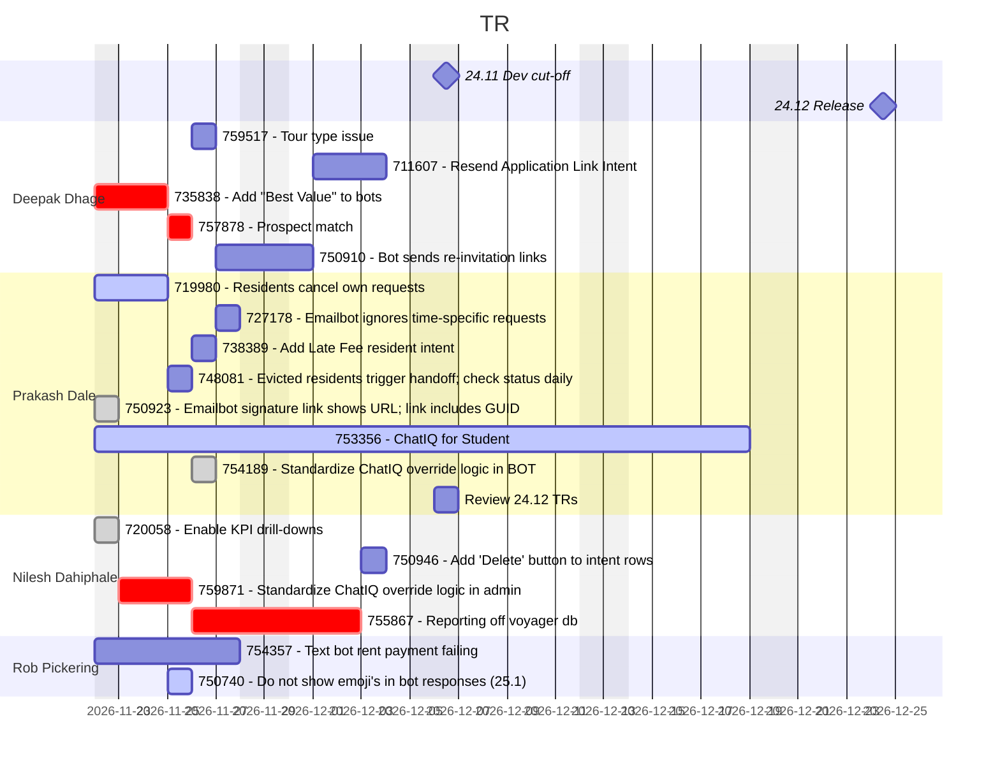
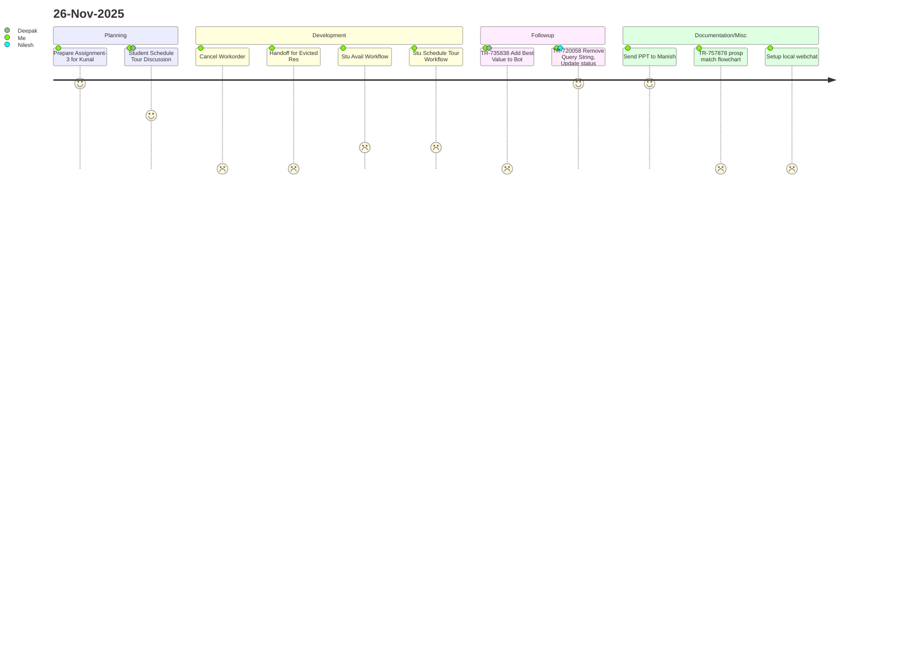
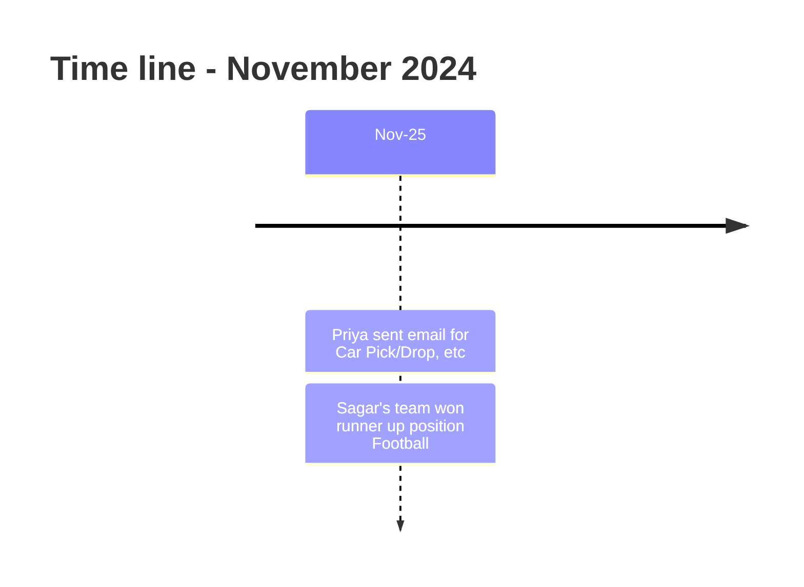
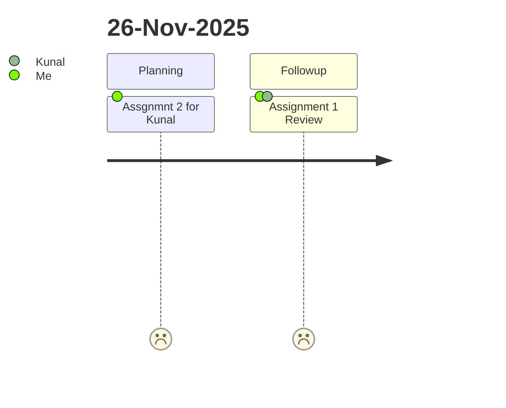

# Quick View

## Release

```mermaid
gantt
    title TR
    dateFormat MMM-DD
    tickInterval 1d
    excludes weekends, 2024-12-25
    24.11 Dev cut-off: milestone, 24.11 Dev cut-off, Dec-06, 1d
    24.12 Release: milestone, 24.12 Release, Dec-24, 1d    
    section Deepak Dhage
        759517 - Tour type issue                                            : 759517, after 757878, 1d       
        711607 - Resend Application Link Intent                             : 711607, after 750910, 3d
        735838 - Add "Best Value" to bots                                   : crit, 735838, Nov-22, 3d
        757878 - Prospect match                                             : crit, 757878, after 735838, 1d
        750910 - Bot sends re-invitation links                              : 750910, after 759517, 2d        
    section Prakash Dale
        719980 - Residents cancel own requests                              : active, 719980, Nov-22, 3d
        727178 - Emailbot ignores time-specific requests                    : 717178, after 738389, 1d
        738389 - Add Late Fee resident intent                               : 738389, after 748081, 1d
        748081 - Evicted residents trigger handoff; check status daily      : 748081, after 719980, 1d
        750923 - Emailbot signature link shows URL; link includes GUID      : done, 750923, Nov-22, 1d
        753356 - ChatIQ for Student                                         : active, 753356, Nov-22, 21d
        754189 - Standardize ChatIQ override logic in BOT                   : done, after 759871, 1d
        Review 24.12 TRs                                                    : 24.11Dev, Dec-06, 1d
    section Nilesh Dahiphale
        720058 - Enable KPI drill-downs                                     : done, 720058, Nov-22, 1d
        750946 - Add 'Delete' button to intent rows                         : 750946, after 755867, 1d
        759871 - Standardize ChatIQ override logic in admin                 : crit, 759871, after 720058, 3d
        755867 - Reporting off voyager db                                   : crit, 755867, after 759871, 5d
    section Rob Pickering
        754357 - Text bot rent payment failing: 754357, Nov-22, 6d
        750740 - Do not show emoji's in bot responses (25.1)                : active, 750740, Nov-25, 1d
```

## My Day

```mermaid
journey
    title 26-Nov-2025
    section Planning
        Prepare Assignment-3 for Kunal: 8: Me
        Student Schedule Tour Discussion: 5: Me, Deepak
    section Development        
        Cancel Workorder: 0: Me
        Handoff for Evicted Res: 0: Me
        Stu Avail Workflow: 2: Me
        Stu Schedule Tour Workflow: 2: Me
    section Followup
        TR-735838 Add Best Value to Bot: 0: Me, Deepak
        TR-720058 Remove Query String, Update status: 8: Me, Nilesh
    section Documentation/Misc
        Send PPT to Manish: 8: Me
        TR-757878 prosp match flowchart: 0: Me
        Setup local webchat: 0: Me
```

```mermaid
timeline
    title Time line - November 2024
    Nov-25  : Priya sent email for Car Pick/Drop, etc
            : Sagar's team won runner up position<br>Football
    
```

## Tasks

### Student Schedule Tour Discussion - Todo

- Determine components involved in Create Lead (Deepak to research)

```mermaid
journey
    title 26-Nov-2025
    section Planning
        Assgnmnt 2 for Kunal: 0: Me
    section Followup
        Assignment 1 Review: 0: Me, Kunal
        
    
```

