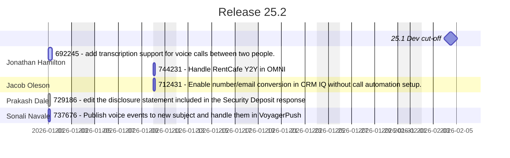
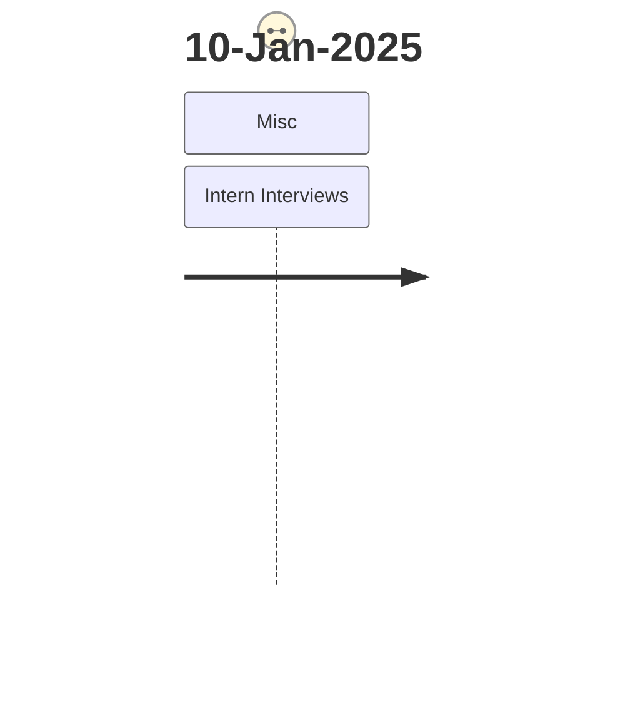

# Quick View

## Release

```mermaid
gantt
    title Release 25.2 
    dateFormat MMM-DD
    tickInterval 4h
    excludes weekends
    25.1 Dev cut-off: milestone, 25.1Dev, Feb-04, 1d
    section Jonathan Hamilton
        692245 - add transcription support for voice calls between two people.  : active, 692245, Jan-01, 8h
        744231 - Handle RentCafe Y2Y in OMNI                                    : 744231, Jan-10, 4h
    section Jacob Oleson
        712431 - Enable number/email conversion in CRM IQ without call automation setup.    : 712431, Jan-10, 4h
    section Prakash Dale
        729186 - edit the disclosure statement included in the Security Deposit response    : done, 729186, Jan-01, 4h
    section Sonali Navale
        737676 - Publish voice events to new subject and handle them in VoyagerPush         : 737676, Jan-01, 4h


    section Deepak Dhage        
        
    section Prakash Dale
    
    section Nilesh Dahiphale        
    
    section Rob Pickering
    
```

## Todo

```mermaid
timeline
    title Reminders   
    section Jan

```

## My Day

```mermaid
journey
    title 10-Jan-2025
    section Development
        
    section Misc
        Intern Interviews: 8, Me        

```

