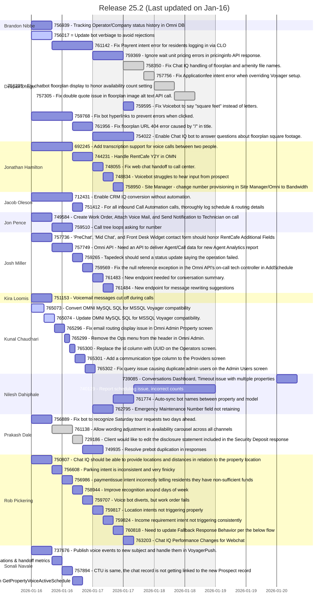

# Quick View

## Release

```mermaid
gantt
    title Release 25.2 (Last updated on Jan-16)
    dateFormat MMM-DD
    tickInterval 4h
    excludes weekends

    section Brandon Nibbe
        756939 - Tracking Operator/Company status history in Omni DB: 756939, Jan-16, 8h

    section Deepak Dhage
        756017 = Update bot verbiage to avoid rejections: active, 756017, Jan-16, 8h
        761142 - Fix Payrent intent error for residents logging in via CLO      : 761142, after 756017, 16h
        759369 - Ignore wait unit pricing errors in pricinginfo API response.   : 759369, after 761142, 12h
        758350 - Fix Chat IQ handling of floorplan and amenity file names.      : done, 758350, after 759369, 8h
        757756 - Fix Applicationfee intent error when overriding Voyager setup. : done, 757756, after 758350, 4h
        756235 - Fix chatbot floorplan display to honor availability count setting: done, 756235, after 757756, 8h
        757305 - Fix double quote issue in floorplan image alt text API call.   : done, 757305, after 756235, 8h
        759595 - Fix Voicebot to say "square feet" instead of letters.          : 759595, after 759369, 4h
        759768 - Fix bot hyperlinks to prevent errors when clicked.             : 759768, Jan-16, 16h
        761956 - Fix floorplan URL 404 error caused by "/" in title.            : 761956, after 759768, 8h
        754022 - Enable Chat IQ bot to answer questions about floorplan square footage.: 754022, after 761956, 16h

    section Jonathan Hamilton
        692245 - Add transcription support for voice calls between two people.: 692245, Jan-16, 16h
        744231 - Handle RentCafe Y2Y in OMN: 744231, after 692245, 8h
        748055 - Fix web chat handoff to call center.: 748055, after 744231, 4h
        748834 - Voicebot struggles to hear input from prospect : 748834, after 748055, 4h
        758950 - Site Manager - change number provisioning in Site Manager/Omni to Bandwidth: 758950, after 748834, 4h

    section Jacob Oleson
        712431 - Enable CRM IQ conversion without automation. : 712431, Jan-16, 16h
        751412 - For all inbound Call Automation calls, thoroughly log schedule & routing details : 751412, after 712431, 4h

    section Jon Pence
        749584 - Create Work Order, Attach Voice Mail, and Send Notification to Technician on call: 749584, Jan-16, 8h
        759510 - Call tree loops asking for number : 759510, after 749584, 8h

    section Josh Miller
        757736 - 'PreChat', 'Mid Chat', and Front Desk Widget contact form should honor RentCafe Additional Fields: 757736, Jan-16, 8h
        757749 - Omni API - Need an API to deliver Agent/Call data for new Agent Analytics report: 757749, after 757736, 8h
        759265 - Tapedeck should send a status update saying the operation failed.: 759265, after 757749, 4h
        759569 - Fix the null reference exception in the Omni API's on-call tech controller in AddSchedule: 759569, after 759265, 4h
        761483 - New endpoint needed for conversation summary.: 761483, after 759569, 4h
        761484 - New endpoint for message rewriting suggestions: 761484, after 761483, 4h

    section Kira Loomis
        751153 - Voicemail messages cut off during calls : 751153, Jan-16, 8h

    section Kunal Chaudhari
        765073 - Convert OMNI MySQL SQL for MSSQL Voyager compatibility         : active, 765073, Jan-16, 5h
        765074 - Update OMNI MySQL SQL for MSSQL Voyager compatibility.         : active, 765074, after 765073, 4h
        765296 - Fix email routing display issue in Omni Admin Property screen  : 765296, after 765074, 4h
        765299 - Remove the Ops menu from the header in Omni Admin.             : 765299, after 765296, 2h
        765300 - Replace the Id column with UUID on the Operators screen.       : 765300, after 765299, 2h
        765301 - Add a communication type column to the Providers screen        : 765301, after 765300, 4h
        765302 - Fix query issue causing duplicate admin users on the Admin Users screen: 765302, after 765301, 4h

    section Nilesh Dahiphale
        739085 - Conversations Dashboard, Timeout issue with multiple properties: 739085, after 740129, 8h
        740129 - Report scheduling issue, incorrect counts: 740129, after 761774, 32h
        761774 - Auto-sync bot names between property and model: 761774, after 762795, 8h
        762795 - Emergency Maintenance Number field not retaining: 762795, Jan-17, 8h
    
    section Prakash Dale
        756889 - Fix bot to recognize Saturday tour requests two days ahead.    : 756889, Jan-16, 8h
        761138 - Allow wording adjustment in availability carousel across all channels: done, 761138, after 756889, 8h
        729186 - Client would like to edit the disclosure statement included in the Security Deposit response: done, 729186, after 761138, 4h
        749935 - Resolve prebot duplication in responses: 749935, after 729186, 8h
        
    section Rob Pickering
        750807 - Chat IQ should be able to provide locations and distances in relation to the property location: 750807, Jan-16, 8h
        756608 - Parking intent is inconsistent and very finicky : 756608, after 750807, 4h
        756986 - paymentissue intent incorrectly telling residents they have non-sufficient funds : 756986, after 756608, 4h
        758944 - Improve recognition around days of week : 758944, after 756986, 4h
        759707 - Voice bot diverts, but work order fails : 759707, after 758944, 4h
        759817 - Location intents not triggering properly : 759817, after 759707, 4h
        759824 - Income requirement intent not triggering consistently : 759824, after 759817, 4h
        760818 - Need to update Fallback Response Behavior per the below flow : 760818, after 759824, 4h
        763203 - Chat IQ Performance Changes for Webchat : 763203, after 760818, 4h

    section Sonali Navale
        737676 - Publish voice events to new subject and handle them in VoyagerPush.: 737676, Jan-16, 8h
        751905 - Undeliverable emails (i.e., mailer-daemon@rentcafe.com) are significantly inflating Chat IQ conversations & handoff metrics: 751905, after 737676, 4h
        757894 - CTU is same, the chat record is not getting linked to the new Prospect record : 757894, after 751905, 4h
        759567 - Fix the null reference exception in the Omni API's property controller in GetPropertyVoiceActiveSchedule: 759567, after 757894, 4h

```
