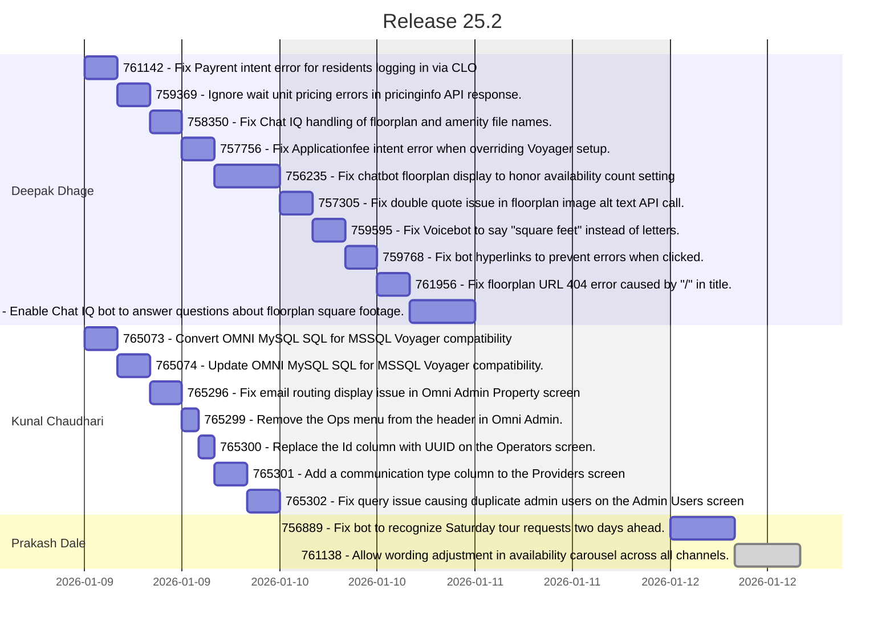

# Quick View

## Release

```mermaid
gantt
    title Release 25.2
    dateFormat MMM-DD
    tickInterval 4h
    excludes weekends

    section Deepak Dhage
        761142 - Fix Payrent intent error for residents logging in via CLO      : 761142, Jan-09, 4h
        759369 - Ignore wait unit pricing errors in pricinginfo API response.   : 759369, after 761142, 4h
        758350 - Fix Chat IQ handling of floorplan and amenity file names.      : 758350, after 759369, 4h
        757756 - Fix Applicationfee intent error when overriding Voyager setup. : 757756, after 758350, 4h
        756235 - Fix chatbot floorplan display to honor availability count setting: 756235, after 757756, 8h
        757305 - Fix double quote issue in floorplan image alt text API call.   : 757305, after 756235, 4h
        759595 - Fix Voicebot to say "square feet" instead of letters.          : 759595, after 757305, 4h
        759768 - Fix bot hyperlinks to prevent errors when clicked.             : 759768, after 759595, 4h
        761956 - Fix floorplan URL 404 error caused by "/" in title.            : 761956, after 759768, 4h
        754022 - Enable Chat IQ bot to answer questions about floorplan square footage.: 754022, after 761956, 8h 

    section Kunal Chaudhari
        765073 - Convert OMNI MySQL SQL for MSSQL Voyager compatibility         : 765073, Jan-09, 4h
        765074 - Update OMNI MySQL SQL for MSSQL Voyager compatibility.         : 765074, after 765073, 4h
        765296 - Fix email routing display issue in Omni Admin Property screen  : 765296, after 765074, 4h
        765299 - Remove the Ops menu from the header in Omni Admin.             : 765299, after 765296, 2h
        765300 - Replace the Id column with UUID on the Operators screen.       : 765300, after 765299, 2h
        765301 - Add a communication type column to the Providers screen        : 765301, after 765300, 4h
        765302 - Fix query issue causing duplicate admin users on the Admin Users screen: 765302, after 765301, 4h
    
    section Prakash Dale
        756889 - Fix bot to recognize Saturday tour requests two days ahead.    : 756889, Jan-12, 8h
        761138 - Allow wording adjustment in availability carousel across all channels.: done, 761138, after 756889, 8h


        


```
