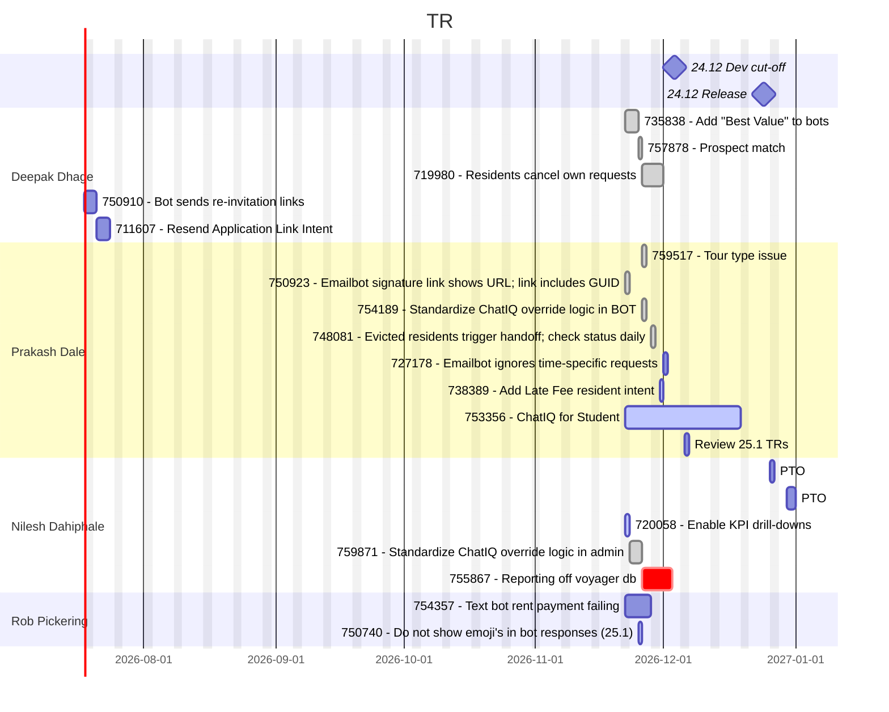
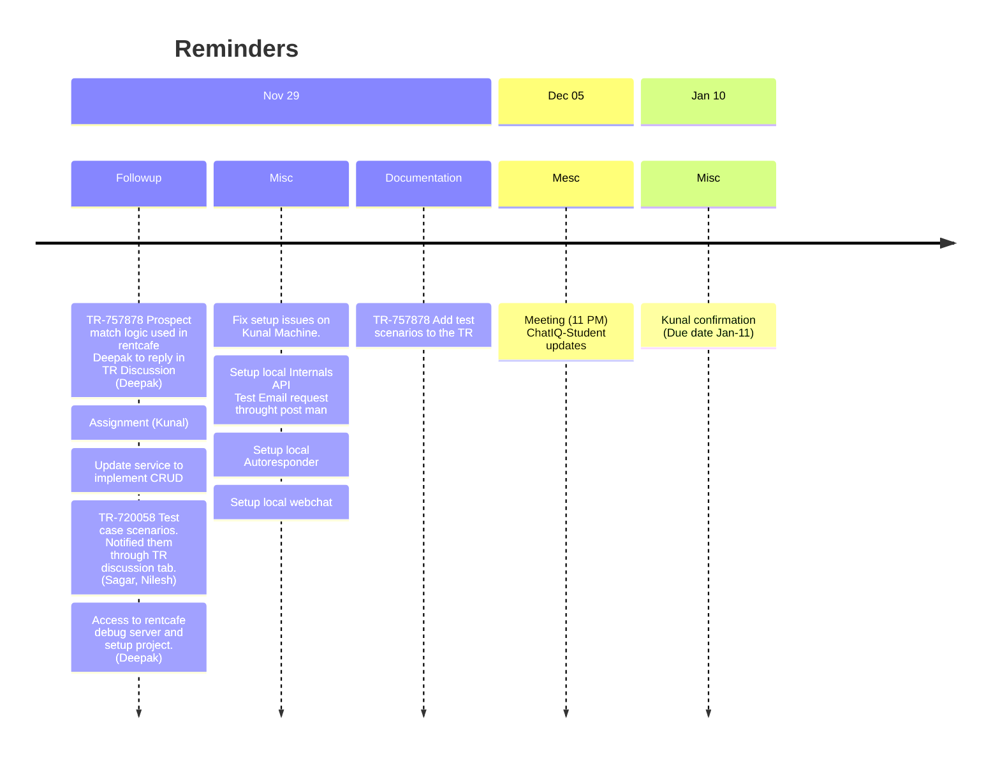

# Quick View

## Release

```mermaid
gantt
    title TR
    dateFormat MMM-DD
    tickInterval 1d
    excludes weekends, 2024-12-25
    24.12 Dev cut-off: milestone, 24.12Dev, Dec-03, 1d
    24.12 Release: milestone, 24.12 Release, Dec-24, 1d    
    section Deepak Dhage        
        
        735838 - Add "Best Value" to bots                                   : done, 735838, Nov-22, 3d
        757878 - Prospect match                                             : done, 757878, after 735838, 1d
        719980 - Residents cancel own requests                              : done, 719980, after 757878, 3d
        750910 - Bot sends re-invitation links                              : 750910, after 24.1Dev, 2d
        711607 - Resend Application Link Intent                             : 711607, after 750910, 3d        
        
    section Prakash Dale
        759517 - Tour type issue                                            : done, 759517, Nov-26, 1d        
        750923 - Emailbot signature link shows URL; link includes GUID      : done, 750923, Nov-22, 1d
        754189 - Standardize ChatIQ override logic in BOT                   : done, after 759871, 1d
        748081 - Evicted residents trigger handoff; check status daily      : done, 748081, Nov-28, 1d
        727178 - Emailbot ignores time-specific requests                    : 717178, after 738389, 1d
        738389 - Add Late Fee resident intent                               : active, 738389, after 748081, 1d
        753356 - ChatIQ for Student                                         : active, 753356, Nov-22, 21d
        
        Review 25.1 TRs                                                    : 24.12Dev, Dec-06, 1d
    section Nilesh Dahiphale        
        PTO                                                                 : PTO1, Dec-26, 1d
        PTO                                                                 : PTO1, Dec-30, 2d
        720058 - Enable KPI drill-downs                                     : active, 720058, Nov-22, 1d        
        759871 - Standardize ChatIQ override logic in admin                 : done, 759871, after 720058, 3d
        755867 - Reporting off voyager db                                   : crit, 755867, after 759871, 5d
    section Rob Pickering
        754357 - Text bot rent payment failing: 754357, Nov-22, 6d
        750740 - Do not show emoji's in bot responses (25.1)                : active, 750740, Nov-25, 1d
```

## My Day

```mermaid
journey
    title 29-Nov-2025
    section Development
        
    section Misc
        

```

## Todo

```mermaid
timeline
    title Reminders   
    section Nov 29
        Followup        : TR-757878 Prospect match logic used in rentcafe<br>Deepak to reply in TR Discussion (Deepak)
                        : Assignment (Kunal): Update service to implement CRUD 
                        : TR-720058 Test case scenarios. Notified them through TR discussion tab. (Sagar, Nilesh)
                        : Access to rentcafe debug server and setup project. (Deepak)
        Misc            : Fix setup issues on Kunal Machine.
                        : Setup local Internals API<br>Test Email request throught post man
                        : Setup local Autoresponder
                        : Setup local webchat                                
        Documentation   : TR-757878 Add test scenarios to the TR
    section Dec 05
        Mesc            : Meeting (11 PM)<br>ChatIQ-Student updates
    section Jan 10      
        Misc            : Kunal confirmation<br>(Due date Jan-11)
```

