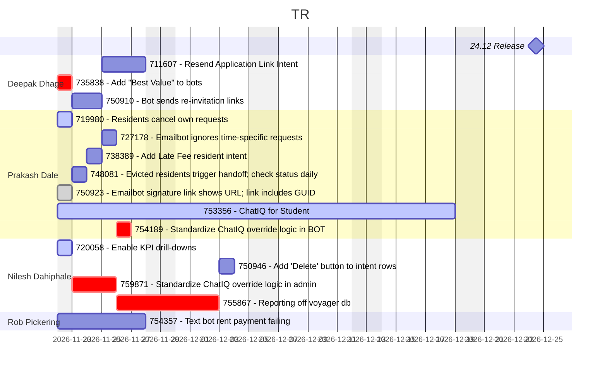
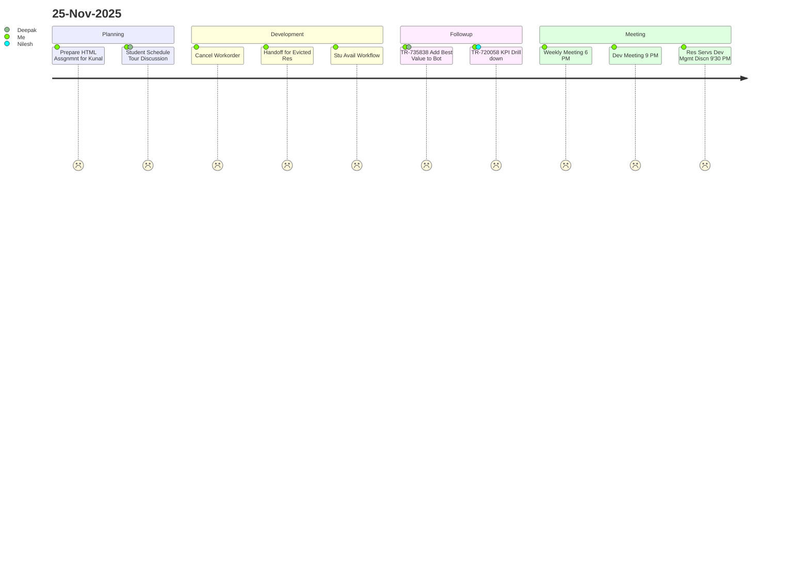

# prakash-dale.github.io

## Release

```mermaid
gantt
    title TR
    dateFormat MMM-DD
    tickInterval 1d
    excludes weekends, 2024-12-25
    24.12 Release: milestone, 24.12 Release, Dec-24, 1d
    section Deepak Dhage        
        711607 - Resend Application Link Intent                             : 711607, after 750910, 3d
        735838 - Add "Best Value" to bots                                   : crit, 735838, Nov-22, 1d
        750910 - Bot sends re-invitation links                              : 750910, after 735838, 2d        
    section Prakash Dale
        719980 - Residents cancel own requests                              : active, 719980, Nov-22, 1d
        727178 - Emailbot ignores time-specific requests                    : 717178, after 738389, 1d
        738389 - Add Late Fee resident intent                               : 738389, after 748081, 1d
        748081 - Evicted residents trigger handoff; check status daily      : 748081, after 719980, 1d
        750923 - Emailbot signature link shows URL; link includes GUID      : done, 750923, Nov-22, 1d
        753356 - ChatIQ for Student                                         : active, 753356, Nov-22, 21d
        754189 - Standardize ChatIQ override logic in BOT                   : crit, after 759871, 1d
    section Nilesh Dahiphale
        720058 - Enable KPI drill-downs                                     : active, 720058, Nov-22, 1d
        750946 - Add 'Delete' button to intent rows                         : 750946, after 755867, 1d
        759871 - Standardize ChatIQ override logic in admin                 : crit, 759871, after 720058, 3d
        755867 - Reporting off voyager db                                   : crit, 755867, after 759871, 5d
    section Rob Pickering
        754357 - Text bot rent payment failing: 754357, Nov-22, 6d
```

## My Day

```mermaid
journey
    title 25-Nov-2025
    section Planning
        Prepare HTML Assgnmnt for Kunal: 0: Me
        Student Schedule Tour Discussion: 0: Me, Deepak
    section Development
        Cancel Workorder: 0: Me
        Handoff for Evicted Res: 0: Me
        Stu Avail Workflow: 0: Me
    section Followup
        TR-735838 Add Best Value to Bot: 0: Me, Deepak
        TR-720058 KPI Drill down: 0: Me, Nilesh
    section Meeting
        Weekly Meeting 6 PM: 0: Me
        Dev Meeting 9 PM: 0: Me
        Res Servs Dev Mgmt Discn 9'30 PM : 0: Me

```