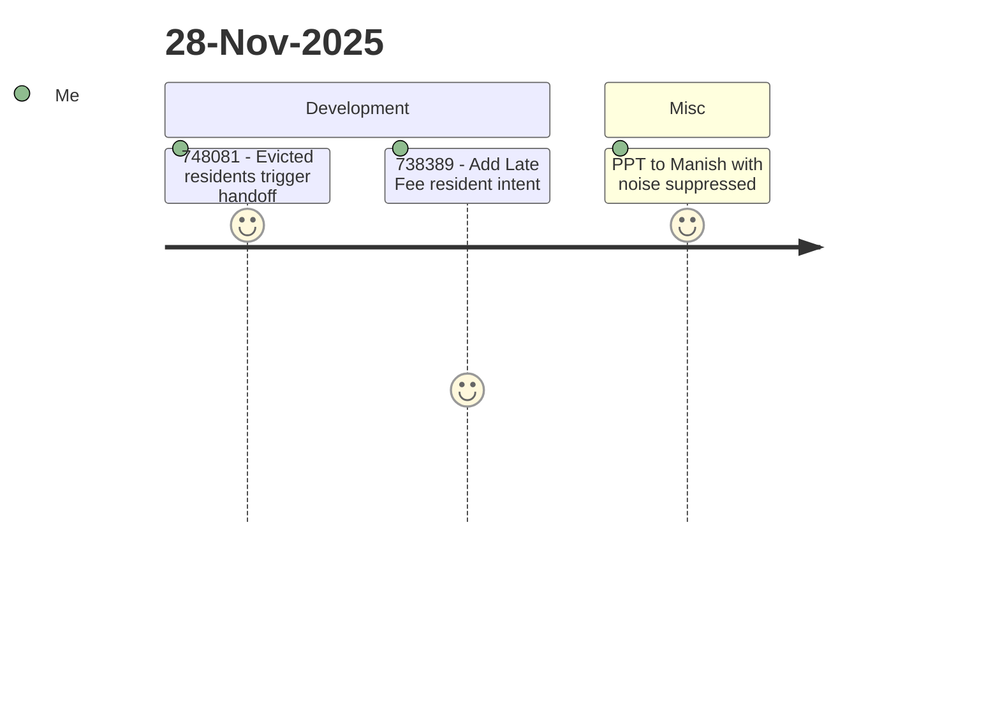
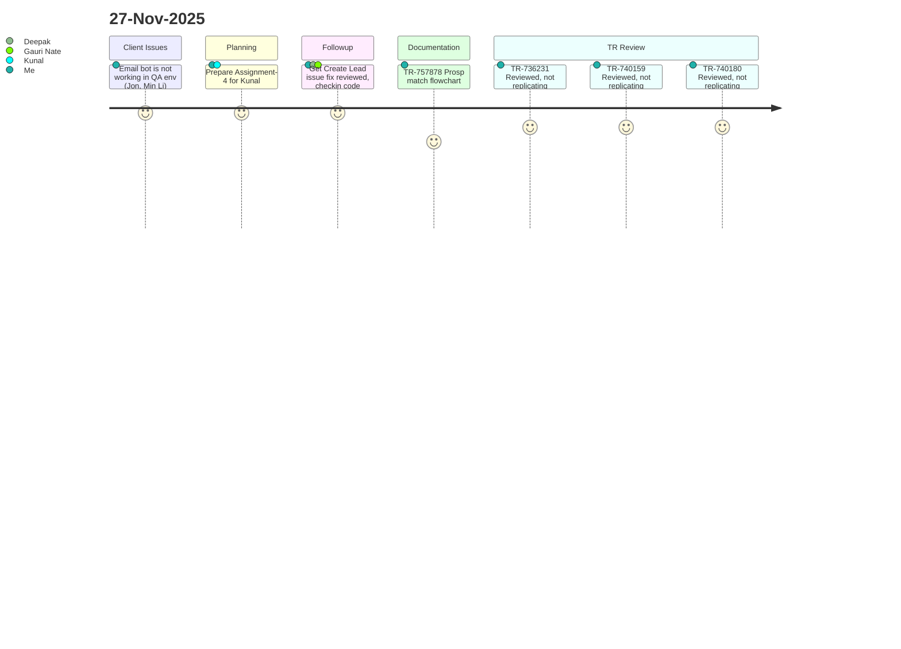
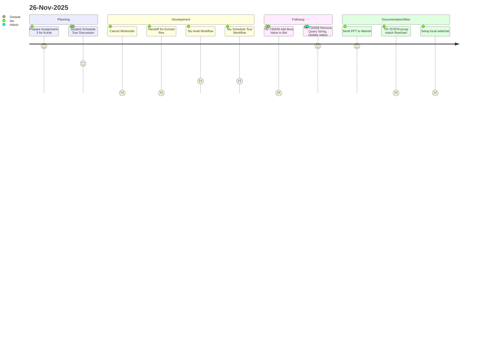
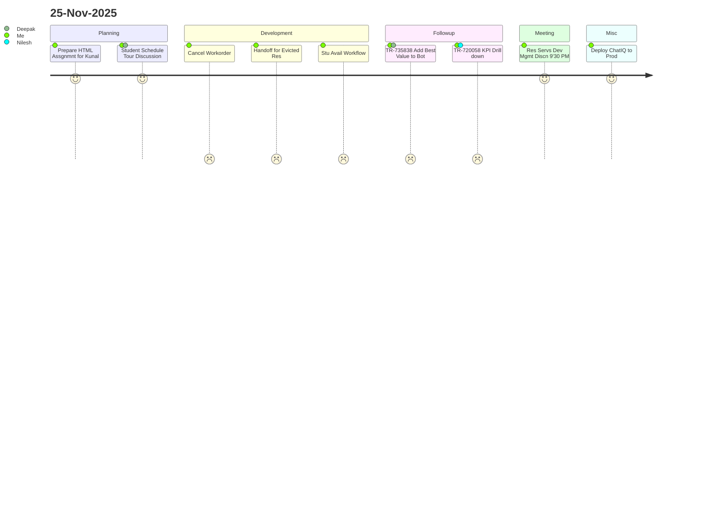

# My Day

```mermaid
journey
    title 28-Nov-2025
    section Development
        748081 - Evicted residents trigger handoff: 9: Me
        738389 - Add Late Fee resident intent: 4: Me
    section Misc
        PPT to Manish with noise suppressed: 9: Me

```

```mermaid
journey
    title 27-Nov-2025
    section Client Issues
        Email bot is not working in QA env (Jon, Min Li): 8: Me
    section Planning
        Prepare Assignment-4 for Kunal: 8 : Me, Kunal
    section Followup
        Get Create Lead issue fix reviewed, checkin code: 8: Me, Deepak, Gauri Nate
    section Documentation
        TR-757878 Prosp match flowchart: 6: Me
    section TR Review
        TR-736231 Reviewed, not replicating: 7: Me
        TR-740159 Reviewed, not replicating: 7: Me
        TR-740180 Reviewed, not replicating: 7: Me
    
```

```mermaid
journey
    title 26-Nov-2025
    section Planning
        Prepare Assignment-3 for Kunal: 8: Me
        Student Schedule Tour Discussion: 5: Me, Deepak
    section Development        
        Cancel Workorder: 0: Me
        Handoff for Evicted Res: 0: Me
        Stu Avail Workflow: 2: Me
        Stu Schedule Tour Workflow: 2: Me
    section Followup
        TR-735838 Add Best Value to Bot: 0: Me, Deepak
        TR-720058 Remove Query String, Update status: 8: Me, Nilesh
    section Documentation/Misc
        Send PPT to Manish: 8: Me
        TR-757878 prosp match flowchart: 0: Me
        Setup local webchat: 0: Me
```

```mermaid
journey
    title 25-Nov-2025
    section Planning
        Prepare HTML Assgnmnt for Kunal: 8: Me
        Student Schedule Tour Discussion: 8: Me, Deepak
    section Development
        Cancel Workorder: 0: Me
        Handoff for Evicted Res: 0: Me
        Stu Avail Workflow: 0: Me
    section Followup
        TR-735838 Add Best Value to Bot: 0: Me, Deepak
        TR-720058 KPI Drill down: 0: Me, Nilesh
    section Meeting
        Res Servs Dev Mgmt Discn 9'30 PM : 8: Me
    section Misc
        Deploy ChatIQ to Prod: 8: Me

```